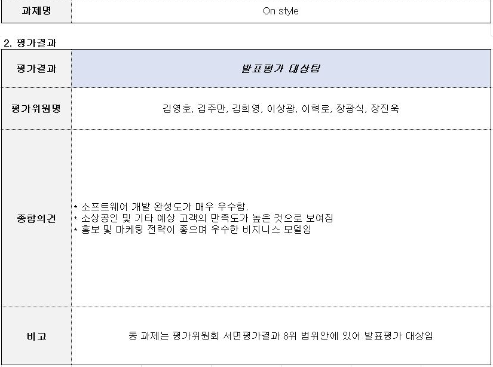

# 온스타일(Onstyle) 프로젝트 폴더 전체 분석

<video src="https://github.com/jaeuk2274/OnStyle/releases/download/v1.0/default.mp4" controls width="100%"></video>

## 1. 프로젝트 개요

| 항목 | 내용 |
|------|------|
| 프로젝트명 | 온스타일 (Onstyle) — 맞춤형 코디 지원 시스템 |
| 주관 | 2017 SW 재능기부 챌린지 |
| 서비스 설명 | 여성 패션 쇼핑몰 "미스봄" 기반의 코디 요청·공유·가상코디 서비스 |
| 개발 버전 | Onstyle 0.4 (소스코드 기준) |
| DB Host | 192.168.0.44 / localhost:3306, Database: onstyle |
| 버전 관리 | 별도 Git 없음, 폴더 버전 관리 방식 |

### 주요역할
나의 옷장, 가상코디, 코디요청 기능 주도 개발

1차 기획/제안서 → 2차 사업계획서 + PT + 개발역량 검증 → 3차 개발 결과 발표 -> 전국 8위권 내 선발


### 관련 문서 목록

| 폴더 | 문서 |
|------|------|
| 00_사업계획서 | SW 재능기부 챌린지 발표자료.pptx, 피드백 수정.hwp |
| 00_온스타일 스토리 | 전체 스토리(관리자, 사용자).xlsx, 최종보고서.hwp/pdf |
| 01_프로세스 | 온스타일 1차 프로세스.pptx |
| 02_기능명세서 | 온스타일 기능 v1.0.xlsx |
| 03_WBS | 관리자웹/사용자웹 v1.0.mpp, 워크백로그(팀원별 xlsx) |
| 04_스토리보드(ver 1.0) | 화면별 스토리보드 pptx (기능별·담당자별) |
| 05_스토리보드(ver 1.2) | 날짜별 수정본 |
| 06_온스타일 데이터사전 | 온스타일 데이터 사전(0.3).xlsx |
| ERD(ver 0.0) | 온스타일 erd(0.1).erwin, 온스타일erd정리(0.0).erwin |
| onstyle.sql | 전체 DB 덤프 파일 |

---

## 2. 기술 스택

### 서버 (onStyle 프로젝트)

| 구분 | 기술 |
|------|------|
| 언어 | Java 1.6 |
| 프레임워크 | Spring MVC 3.2.4.RELEASE |
| 빌드 도구 | Maven (pom.xml) |
| 패키징 | WAR (Tomcat 배포) |
| ORM / DB | MyBatis 3.2.2 + mybatis-spring 1.1.1 |
| DB | MySQL 5.7 |
| DB 드라이버 | mysql-connector-java 5.1.26 |
| 뷰 기술 | JSP 2.2 + JSTL 1.2 |
| JSON | Jackson 1.9.13, json-lib 2.4, json-simple 1.1.1 |
| 파일 업로드 | commons-fileupload 1.2.2 + commons-io 2.0.1 |
| 로깅 | SLF4J 1.6.6 + Log4j 1.2.15 + log4jdbc-remix 0.2.7 |
| 보안 | SEED 암호화(SeedAlg.java), Base64(Base64Utils.java), CORS Filter |
| 결제 | INIStd (이니시스 표준 결제 모듈) |
| AOP | AspectJ 1.6.10 |
| 테스트 | JUnit 4.7 |

### 모바일 앱 (MainActivity 프로젝트)

| 구분 | 기술 |
|------|------|
| 플랫폼 | Android (minSdk 16, targetSdk 25) |
| 앱 방식 | Apache Cordova (PhoneGap) 하이브리드 앱 |
| 패키지명 | com.net.su.OnStyleApp |
| UI 라이브러리 | jQuery Mobile 1.4.5 |
| 테마 | NativeDroid2 |
| 슬라이더 | bxSlider |
| 통신 | Ajax (서버 REST API 호출, 서버 IP 192.168.0.19:9029) |
| 추가 모듈 | CordovaLib |

---

## 3. 프로젝트 구조

```
2017 SW 재능기부 챌린지-온스타일/
├── 00_사업계획서/
├── 00_온스타일 스토리/
├── 01_프로세스/
├── 02_기능명세서/
├── 03_WBS/
├── 04_ 스토리보드(ver 1.0)/
├── 05_ 스토리보드(ver 1.2)/
├── 06_온스타일 데이터사전/
├── 07_워크백로그/
├── 09_회의사진(멘토님없음)/
├── 09_회의사진(멘토님있음)/
├── 10_완료보고서/
├── 11_시연 동영상/
├── ERD(ver 0.0)/
│   ├── 온스타일 erd(0.1).erwin
│   └── 온스타일erd정리(0.0).erwin
├── Onstyle0.4/
│   ├── onStyle/                    ← 메인 서버 프로젝트 (Spring MVC + MyBatis)
│   │   ├── pom.xml
│   │   └── src/main/
│   │       ├── java/net/su/
│   │       │   ├── admin/          ← 관리자 도메인
│   │       │   │   ├── codi/       (코디요청관리, 코디공유관리)
│   │       │   │   ├── main/       (관리자 메인/메뉴)
│   │       │   │   ├── mem/        (회원관리)
│   │       │   │   ├── ordr/       (주문관리)
│   │       │   │   ├── prodct/     (상품관리, 진열관리)
│   │       │   │   └── store/      (매장관리)
│   │       │   ├── app/            ← 모바일 앱 API 도메인
│   │       │   │   ├── appCodi/    (앱용 코디 API)
│   │       │   │   ├── appLogin/   (앱용 로그인 API)
│   │       │   │   ├── appMain/    (앱용 메인 API)
│   │       │   │   ├── appMem/     (앱용 회원 API)
│   │       │   │   ├── appOrdr/    (앱용 주문 API)
│   │       │   │   └── appProdct/  (앱용 상품 API)
│   │       │   ├── common/
│   │       │   │   └── security/   (CORS Filter, SEED, Base64, PageVO)
│   │       │   ├── consmr/         ← 소비자(사용자) 도메인
│   │       │   │   ├── codi/       (코디요청, 코디공유, 나의옷장/가상코디)
│   │       │   │   ├── login/      (로그인, 회원가입)
│   │       │   │   ├── main/       (메인 화면)
│   │       │   │   ├── mem/        (회원정보, 마이페이지)
│   │       │   │   ├── ordr/       (주문, 결제, 장바구니)
│   │       │   │   └── prodct/     (상품 조회)
│   │       │   └── logger/
│   │       │       └── Logger.java
│   │       ├── resources/
│   │       │   ├── Props/globals.properties  (DB 접속 정보)
│   │       │   ├── mybatis/
│   │       │   │   ├── mybatis-config.xml
│   │       │   │   └── sql/
│   │       │   │       ├── admin/  (codi, main, mem, ordr, prodct, store)
│   │       │   │       ├── app/    (appCodi, appLogin, appMain, appMem, appOrdr, appProdct)
│   │       │   │       └── consmr/ (codi, login, main, mem, ordr, prodct)
│   │       │   └── log4j.xml
│   │       └── webapp/WEB-INF/
│   │           ├── spring/
│   │           │   ├── root-context.xml
│   │           │   └── appServlet/servlet-context.xml
│   │           ├── views/
│   │           │   ├── adminView/  (관리자 화면 JSP)
│   │           │   └── consmrView/ (사용자 화면 JSP)
│   │           └── web.xml
│   ├── MainActivity/               ← Android Cordova 앱 프로젝트
│   │   ├── AndroidManifest.xml
│   │   ├── build.gradle
│   │   ├── assets/www/             ← Cordova 웹 앱 리소스
│   │   │   ├── index.html
│   │   │   ├── view/               (HTML 페이지들)
│   │   │   │   ├── main.html
│   │   │   │   ├── login.html
│   │   │   │   ├── join.html
│   │   │   │   ├── topMenu.html
│   │   │   │   ├── leftTabPanel.html
│   │   │   │   └── MyDressRoomVirtualCodi.html
│   │   │   ├── js/                 (기능별 JS)
│   │   │   │   ├── codi/
│   │   │   │   ├── main/
│   │   │   │   ├── login/
│   │   │   │   ├── mem/
│   │   │   │   ├── ordr/
│   │   │   │   └── prodct/
│   │   │   └── css/
│   │   └── src/com/net/su/         (Java MainActivity)
│   └── CordovaLib/                 ← Cordova 라이브러리 모듈
├── onstyle.sql                     ← 전체 DB 스키마 + 데이터 덤프
└── 온스타일 erd!.erwin
```

### 각 모듈 설명

| 모듈 | 설명 |
|------|------|
| `onStyle` | Spring MVC 웹 서버. 사용자 웹, 관리자 웹, 앱 API를 모두 하나의 WAR로 제공 |
| `MainActivity` | Apache Cordova 기반 Android 하이브리드 앱. HTML/JS로 UI 구성, Ajax로 서버 API 호출 |
| `CordovaLib` | Cordova 공용 라이브러리 (Android 모듈) |

---

## 4. 화면 구조 (Screen Flow)

### 4-1. 사용자 웹 (consmrView)

#### 메인 / 공통
| 화면 파일 | 설명 |
|-----------|------|
| `consmrMain.jsp` | 메인 홈 (상품 목록 노출) |
| `consmrMenu.jsp` | 메뉴 화면 |
| `bootswatch.jsp` | 부트스트랩 테마 적용 레이아웃 |

#### 로그인 / 회원가입
| 화면 파일 | 설명 |
|-----------|------|
| `loginForm.jsp` | 로그인 화면 |
| `memInsert.jsp` | 회원가입 화면 |

#### 마이페이지 / 회원정보
| 화면 파일 | 설명 |
|-----------|------|
| `MypageHome.jsp` | 마이페이지 홈 |
| `PassWord.jsp` | 비밀번호 확인 화면 |
| `Join.jsp` | 회원정보 조회/수정 |
| `Points.jsp` | 적립금(E-캐시) 조회 |

#### 상품
| 화면 파일 | 설명 |
|-----------|------|
| `prodctFramePage.jsp` | 상품 목록 프레임 페이지 |
| `prodctViewPage.jsp` | 상품 상세보기 |
| `newProdct.jsp` | 신상품 목록 |
| `Cart.jsp` | 장바구니 |

#### 주문 / 결제 (INI 이니시스 연동)
| 화면 파일 | 설명 |
|-----------|------|
| `OrderStart.jsp` | 결제 시작 화면 |
| `OrderList.jsp` | 주문 내역 조회 |
| `OrderInformation.jsp` | 주문 상세 조회 |
| `OrderPopup.jsp` | 결제 팝업 |
| `OrderClose.jsp` | 결제 닫기 |
| `OrderReturn.jsp` | 결제 결과 반환 |
| `OdExchangeList.jsp` | 취소·교환·반품 내역 |
| `And.jsp` | 결제 취소 안내 |
| `INIStdPayBill.jsp` | INI 이니시스 결제 요청 |
| `INIStdPayRelay.jsp` | INI 이니시스 결과 중계 |
| `INIStdCancel.jsp/.html` | INI 결제 취소 |

#### 코디 - 코디요청 (codiReqst)
| 화면 파일 | 설명 |
|-----------|------|
| `reqstVirtualCodi.jsp` | 코디요청 페이지 (가상코디 에디터) |
| `reqstBreakdwn.jsp` | 코디요청 내역 홈 |
| `reqstList.jsp` | 코디요청 목록 |
| `reqstRead.jsp` | 코디요청 상세보기 (답변 포함) |

#### 코디 - 코디공유 (codiShr, "오늘 나 어때?")
| 화면 파일 | 설명 |
|-----------|------|
| `codiShr.jsp` | 코디공유 게시판 홈 |
| `codiShrList.jsp` | 코디 공유 목록 |
| `bestCodiShr.jsp` | 베스트 코디 목록 |
| `codiView.jsp` | 코디 공유 상세보기 (댓글 포함) |

#### 코디 - 나의 옷장 / 가상코디 (myDressRoom)
| 화면 파일 | 설명 |
|-----------|------|
| `virtualCodi.jsp` | 가상코디 편집기 |
| `clothSelectList.jsp` | 옷 목록 선택 |
| `insertClothPopup.jsp` | 나의 옷 등록 팝업 |
| `codiListFrame.jsp` | 나의 코디 목록 프레임 |
| `codiList.jsp` | 나의 코디 목록 (나의 코디/답변받은 코디/스크랩 코디) |
| `codiRead.jsp` | 코디 상세보기 |
| `codiUsedPordct.jsp` | 코디에 사용된 상품 목록 |
| `myCodiUpdate.jsp` | 나의 코디 수정 편집기 |

---

### 4-2. 관리자 웹 (adminView)

#### 관리자 메인
| 화면 파일 | 설명 |
|-----------|------|
| `adminMain.jsp` | 관리자 메인 대시보드 (코디요청 현황 + 코디공유 현황) |
| `adminTopMenu.jsp` | 관리자 상단 메뉴 |
| `adminLeftMenu.jsp` | 관리자 좌측 메뉴 |
| `adminBootswatch.jsp` | 관리자 레이아웃 |

#### 관리자 고객관리 (mem)
| 화면 파일 | 설명 |
|-----------|------|
| `memHome.jsp` | 고객관리 홈 |
| `memList.jsp` | 회원 목록 |
| `memRead.jsp` | 회원 상세 조회 |

#### 관리자 코디요청 (codiReqst)
| 화면 파일 | 설명 |
|-----------|------|
| `codiReqstHome.jsp` | 코디요청 관리 홈 |
| `adminCodiReqstList.jsp` | 코디요청 목록 |
| `adminCodiReqstRead.jsp` | 코디요청 상세 (요청 내용 + 요청 코디 이미지) |
| `answrVirtualCodi.jsp` | 코디 답변 가상코디 편집기 |
| `answrCodiUpdate.jsp` | 코디 답변 수정 |

#### 관리자 코디공유 (codiShr)
| 화면 파일 | 설명 |
|-----------|------|
| `codiShrHome.jsp` | 코디공유 관리 홈 |
| `codiShrList.jsp` | 코디공유 목록 |
| `codiShrRead.jsp` | 코디공유 상세 (댓글 관리 포함) |

#### 관리자 주문관리 (ordr)
| 화면 파일 | 설명 |
|-----------|------|
| `ordrHome.jsp` | 주문관리 홈 |
| `allOrder.jsp` | 전체 주문 목록 |
| `creditList.jsp` | 입금 전 주문 |
| `prodctReadyList.jsp` | 상품 준비중 |
| `shippingReady.jsp` | 배송 준비중 (송장번호 입력) |
| `shippingList.jsp` | 배송중 |
| `shippingFinish.jsp` | 배송 완료 |
| `creditCancel.jsp` | 입금 전 취소 |
| `creditWoocancel.jsp` | 입금 후 취소 |
| `exchangeList.jsp` | 교환 관리 |
| `returnList.jsp` | 반품 관리 |
| `orderInfor.jsp` | 송장번호 조회/수정 |

#### 관리자 상품관리 (prodct)
| 화면 파일 | 설명 |
|-----------|------|
| `prodctHome.jsp` | 상품관리 홈 |
| `prodctInsertPage.jsp` | 상품 등록 |
| `prodctUpdatePage.jsp` | 상품 수정 |
| `prodctUpdateColorPage.jsp` | 상품 색상 수정 |
| `prodctColorPopUp.jsp` | 색상 선택 팝업 |
| `prodctSizePopUp.jsp` | 사이즈 선택 팝업 |
| `tempSizePage.jsp` | 사이즈 임시 등록 페이지 |
| `prodctDisply.jsp` | 진열관리 화면 |
| `prodctCategoryDisply.jsp` | 카테고리별 진열 상품 조회 |
| `categoryUpdatePopUp.jsp` | 카테고리 수정 팝업 |

#### 관리자 매장관리
| 화면 파일 | 설명 |
|-----------|------|
| `storeHome.jsp` | 매장관리 홈 |

---

### 4-3. 모바일 앱 (Cordova HTML)

| 화면 파일 | 설명 |
|-----------|------|
| `index.html` | Cordova 앱 진입점 |
| `view/main.html` | 앱 메인 (배너 슬라이더, 상품 카테고리 네비게이션) |
| `view/login.html` | 로그인 |
| `view/join.html` | 회원가입 |
| `view/topMenu.html` | 상단 메뉴바 |
| `view/leftTabPanel.html` | 좌측 슬라이드 탭 패널 |
| `view/MyDressRoomVirtualCodi.html` | 모바일 가상코디 편집기 |

---

## 5. DB 구성

### 5-1. 전체 테이블 목록

| 테이블명 | 설명 |
|----------|------|
| `mem_tb` | 회원 기본 정보 |
| `mem_size_tb` | 회원 신체 사이즈 정보 |
| `category_tb` | 상품 카테고리 (Top, Bottom, Dress, Shoes&Bag, Outer 등) |
| `prodct` | 상품 기본 정보 |
| `prodct_color_tb` | 상품 색상 정보 |
| `top_size_tb` | 상의 사이즈 (실제 상품 연결) |
| `top_size_temp_tb` | 상의 사이즈 임시 테이블 (등록 중 임시 보관) |
| `bottom_size_tb` | 하의 사이즈 (실제 상품 연결) |
| `bottom_size_temp_tb` | 하의 사이즈 임시 테이블 |
| `disply_tb` | 진열 정보 (메인/카테고리별 진열 순서) |
| `client` | 거래처 정보 |
| `shpbag_tb` | 장바구니 |
| `order_tb` | 주문 기본 정보 |
| `order_breakdwn_tb` | 주문 상세 내역 (주문별 상품 목록) |
| `ecash_tb` | E-캐시(적립금) 이력 |
| `takebck_tb` | 반품 정보 |
| `sale_tb` | 세일 정보 |
| `sale_bridge_tb` | 세일-상품 연결 브릿지 |
| `mycloth_tb` | 나의 옷장 (회원이 등록한 옷 이미지) |
| `codi_tb` | 코디 기본 정보 (이미지 경로, 회원, 코디 타입) |
| `codi_use_tb` | 코디에 사용된 옷/상품 위치 정보 (x,y 좌표, 크기) |
| `codi_reqst_tb` | 코디 요청 정보 |
| `codi_answr_tb` | 코디 요청에 대한 답변 (관리자 답변 코디 연결) |
| `codi_shr_tb` | 코디 공유 게시글 정보 |
| `codi_reply_tb` | 코디 공유 댓글 |
| `like_tb` | 코디 공유 좋아요 |
| `scrap_codi_tb` | 코디 스크랩 |
| `qustn_tb` | 문의(Q&A) 테이블 |
| `qustn_reply_tb` | 문의 답변 |
| `code_tb` | 공통 코드 테이블 |

### 5-2. 주요 테이블 상세

#### mem_tb (회원)
| 컬럼 | 타입 | 설명 |
|------|------|------|
| mem_seq | int PK | 회원 일련번호 |
| mem_id | varchar(50) | 아이디 |
| mem_pw | varchar(50) | 비밀번호 |
| mem_name | varchar(50) | 이름 |
| mem_nicknme | varchar(50) | 닉네임 |
| mem_birth | date | 생년월일 |
| mem_postcd | varchar(50) | 우편번호 |
| mem_adrs | varchar(300) | 주소 |
| mem_detail_adrs | varchar(300) | 상세 주소 |
| mem_ph | varchar(30) | 전화번호 |
| mem_email | varchar(100) | 이메일 |
| mem_blckLst_chk | varchar(50) | 블랙리스트 여부 |
| mem_ecash | int | 보유 E-캐시(적립금) |
| mem_img_route | varchar(500) | 프로필 이미지 경로 |

#### prodct (상품)
| 컬럼 | 타입 | 설명 |
|------|------|------|
| prodct_seq | int PK | 상품 일련번호 |
| prodct_nme | varchar(300) | 상품명 |
| prodct_img_route1~4 | varchar(500) | 상품 이미지 경로 (최대 4장) |
| prodct_price | int | 판매 가격 |
| suplr_price | int | 공급 단가 |
| prodct_detail | varchar(15000) | 상품 상세 설명 (HTML) |
| prodct_disply_state | varchar(100) | 진열 상태 (Y/N) |
| prodct_sell_state | varchar(50) | 판매 상태 (Y/N) |
| prodct_state | varchar(45) | 상품 상태 |
| category_seq | int FK | 카테고리 |
| client_seq | int FK | 거래처 |
| transparent_img_route | varchar(500) | 배경제거 투명 이미지 경로 (가상코디용) |

#### order_tb (주문)
| 컬럼 | 타입 | 설명 |
|------|------|------|
| order_seq | int PK AI | 주문 일련번호 |
| order_date | date | 주문 일자 |
| order_state | varchar(100) | 주문 상태 (입금전/상품준비중/배송준비중/배송중/배송완료/취소/교환/반품 등) |
| order_dlivy_num | int | 송장 번호 |
| order_methd | varchar(100) | 결제 수단 |
| order_sum | int | 결제 금액 |
| order_use_ecash_sum | int | 사용 적립금 |
| mem_postcd | varchar(100) | 배송지 우편번호 |
| mem_adrs | varchar(300) | 배송지 주소 |
| mem_detail_adrs | varchar(300) | 배송지 상세 주소 |
| order_msg | varchar(500) | 배송 메시지 |
| order_paree | varchar(100) | 수령인 |
| shipping_date | date | 배송일 |
| mem_seq | int FK | 주문 회원 |

#### codi_tb (코디)
| 컬럼 | 타입 | 설명 |
|------|------|------|
| codi_seq | int PK | 코디 일련번호 |
| codi_img_route | varchar(500) | 코디 이미지 경로 |
| mem_seq | int FK | 코디 작성 회원 |
| codi_type | int | 코디 유형 (0:코디요청용, 1:나의코디, 2:답변받은코디) |

#### codi_use_tb (코디에 사용된 옷/상품)
| 컬럼 | 타입 | 설명 |
|------|------|------|
| codi_use_seq | int PK | 일련번호 |
| codi_use_xpoint | varchar(100) | 캔버스 X 좌표 |
| codi_use_ypoint | varchar(100) | 캔버스 Y 좌표 |
| codi_use_width | varchar(45) | 이미지 너비 |
| codi_use_sort | int | 레이어 순서 (Z-index) |
| prodct_seq | int FK | 사용된 쇼핑몰 상품 |
| myCloth_seq | int FK | 사용된 나의 옷 |
| codi_seq | int FK | 코디 |

#### category_tb (카테고리)
| 데이터 | 분류 |
|--------|------|
| Top (#) | 대분류: T-shirts, Blouse&Shirts, Knit |
| Bottom (#) | 대분류: Pants, Skirts |
| Dress (#) | 원피스 |
| Shoes&Bag (#) | 신발, 가방 |
| Outer (#) | 아우터 |

---

## 6. 핵심 기능

### 6-1. 회원 관리 (LoginController, MemController)
- **회원가입**: 아이디/닉네임 중복 체크 → 프로필 사진 업로드 포함 회원 정보 입력 → DB 저장
- **로그인/로그아웃**: 세션 기반 인증. 로그인 성공 시 `session.setAttribute("userInfo", memVO)` 저장
- **회원정보 수정**: 비밀번호 재확인 후 정보 조회·수정 (AJAX 방식)
- **적립금 조회**: 구매 시 적립된 E-캐시 이력 조회

### 6-2. 상품 조회 / 장바구니 (ProdctController)
- **상품 목록**: 카테고리별 상품 목록 조회 (진열 순서 반영)
- **상품 상세**: 이미지, 색상 목록, 사이즈 목록, 상품에 활용된 베스트 코디 미리보기 제공
- **장바구니**: 상품 옵션(색상, 사이즈) 선택 후 장바구니 추가, 목록 조회, 삭제

### 6-3. 결제 (OrdrController + INI 이니시스)
- **결제 흐름**: 장바구니 → 결제금액 계산(5만원 미만 배송비 2,500원 추가, 적립금 차감) → INI 이니시스 표준 결제 팝업 → 결제 결과 콜백 → 주문 정보 DB 저장 → 적립금 적립
- **취소/교환/반품**: 주문 내역에서 요청 가능, 관리자 처리

### 6-4. 나의 옷장 / 가상코디 (MyDressRoomController)
- **나의 옷 등록**: 옷 사진 업로드, 카테고리 분류(Top/Bottom/Dress/Shoes&Bag)
- **배경 제거**: Java `BufferedImage` 픽셀 분석으로 밝은 배경(RGB 185 이상) 투명 처리
- **가상코디 편집기**: 캔버스 위에 나의 옷 또는 미스봄 쇼핑몰 상품 이미지를 드래그·리사이즈하여 코디 구성
- **코디 저장**: 캔버스를 PNG(Base64)로 캡처 → 서버에 파일 저장 → DB에 이미지 경로 및 사용된 옷/상품 좌표 저장
- **코디 종류 구분**:
  - `codi_type=0`: 코디요청을 위한 코디 (사용자가 요청 시 작성)
  - `codi_type=1`: 나의 코디 (사용자 자유 창작)
  - `codi_type=2`: 답변받은 코디 (관리자 답변 후 사용자가 저장)
  - `codiSaveType=4`: 관리자가 작성한 답변 코디

### 6-5. 코디 요청 (CodiReqstController, AdminCodiReqstController)
- **사용자 코디 요청**: 가상코디 편집기로 현재 가진 옷을 코디하고, 코디 요청 멘트와 함께 등록
- **관리자 코디 답변**: 관리자가 요청 목록에서 선택 → 가상코디 편집기로 답변 코디 작성 → 답변 멘트 입력 → 저장 시 `codi_reqst_state='y'`로 변경
- **사용자 답변 확인**: 요청 상세보기에서 답변 코디 이미지·멘트 확인 → "내 코디로 저장" 가능
- **수정 기능**: 사용자 요청 코디, 관리자 답변 코디 모두 수정 가능

### 6-6. 코디 공유 게시판 (CodiShrController — "오늘 나 어때?")
- **공유**: 나의 코디 목록에서 "공유하기" 클릭 시 `codi_shr_tb`에 등록
- **목록 조회**: 전체 코디 목록 / 베스트 코디(좋아요 기준 상위) 분리 조회
- **상세 보기**: 코디 이미지, 작성자 다른 코디 목록, 코디에 사용된 상품 목록, 댓글 조회
- **좋아요**: 좋아요 토글(등록/취소), 좋아요 수 카운트
- **스크랩**: 다른 사용자 코디를 스크랩하여 나의 옷장에 저장
- **댓글**: 등록·조회·삭제 (비로그인 시 경고 알림)
- **공유 취소**: 코디 공유 취소 가능 (cancelShr 메서드, 실제 구현은 주석 처리)

### 6-7. 관리자 기능

#### 대시보드
- 관리자 메인에 코디요청 현황 5건 + 코디공유 현황 5건 요약 표시

#### 상품 관리
- 상품 등록: 이미지 4장, 색상(다중), 사이즈(Top/Bottom 별도 스펙), 거래처, 카테고리, 상세설명(HTML 에디터), 투명 이미지
- 임시 사이즈 테이블(`top_size_temp_tb`, `bottom_size_temp_tb`)에 먼저 저장 후 확정
- 상품 수정, 색상 수정/삭제

#### 진열 관리
- 카테고리별 상품 진열 순서 드래그앤드롭으로 변경
- 상품 상태(진열/미진열, 판매/판매중지) 변경
- 카테고리 분류 수정 팝업

#### 주문 관리
- 주문 상태별 관리: 입금전 → 상품준비중 → 배송준비중(송장입력) → 배송중 → 배송완료
- 취소(입금전/입금후), 교환, 반품 별도 관리

#### 고객 관리
- 회원 목록 조회, 회원 상세 조회

---

## 7. 프로세스 흐름

### 7-1. 사용자 구매 프로세스
```
메인 화면
  → 카테고리 선택 / 상품 목록
  → 상품 상세 보기 (색상·사이즈 선택)
  → 장바구니 담기
  → 장바구니 확인
  → 결제 시작 (배송 정보 입력, 적립금 사용)
  → INI 이니시스 결제 팝업 (신용카드/계좌이체 등)
  → 결제 성공 → 주문 DB 저장, 적립금 적립
  → 주문 내역 확인
```

### 7-2. 코디 요청 프로세스
```
로그인 확인
  → [사용자] 코디요청 페이지 이동
  → 가상코디 편집기: 나의 옷 또는 미스봄 상품 선택
  → 캔버스에 배치·조정
  → 코디 요청 멘트 입력
  → 저장 (코디 이미지 서버 저장 + DB 등록)
  
  [관리자] 코디요청 목록 확인
  → 요청 상세보기 (요청 코디 이미지, 멘트 확인)
  → 답변 가상코디 편집기 진입
  → 답변 코디 작성, 답변 멘트 입력
  → 저장 → codi_reqst_state = 'y' 업데이트
  
  [사용자] 코디요청 내역에서 답변 확인
  → 답변 코디 이미지 + 멘트 확인
  → "내 코디로 저장" 가능
```

### 7-3. 코디 공유 프로세스
```
나의 코디 목록
  → "공유하기" 클릭 → codi_shr_tb 등록
  
  [사용자] "오늘 나 어때?" 게시판
  → 전체 코디 목록 / 베스트 코디 조회
  → 코디 상세보기
    - 좋아요 토글
    - 댓글 작성
    - 스크랩 (나의 코디로 저장)
    - 코디에 사용된 미스봄 상품 확인 → 쇼핑몰 연결
```

### 7-4. 관리자 주문 처리 프로세스
```
주문 들어옴 (결제 완료)
  → 관리자: 입금전 목록 확인 → 처리여부 변경
  → 상품준비중 → 처리여부 변경
  → 배송준비중 → 송장번호 입력
  → 배송중 → 처리여부 변경
  → 배송완료
  
  취소/교환/반품: 별도 목록에서 관리
```

---

## 8. API 구조

서버는 Spring MVC의 `@RequestMapping`으로 URL을 정의하며, Ajax 요청(`@ResponseBody`)과 페이지 이동(View 반환) 방식을 혼용합니다. 모바일 앱은 `app` 패키지의 Controller를 통해 JSON API를 제공합니다.

### 8-1. 사용자 웹 주요 URL

| URL | 방식 | 설명 |
|-----|------|------|
| `/` | GET | 메인 화면 |
| `/login.do` | GET | 로그인 화면 |
| `/memLoginCheck.do` | POST (Ajax) | 로그인 처리 (JSON 반환) |
| `/logout.do` | GET | 로그아웃 |
| `/insertView.do` | GET | 회원가입 화면 |
| `/memInsert.do` | POST (Ajax) | 회원가입 처리 |
| `/idcheck.do` | POST (Ajax) | 아이디 중복 체크 |
| `/nicknmecheck.do` | POST (Ajax) | 닉네임 중복 체크 |
| `/password.do` | GET/POST | 비밀번호 확인 화면 |
| `/passCheck.do` | GET/POST (Ajax) | 비밀번호 확인 처리 |
| `/join.do` | GET/POST | 회원정보 조회 |
| `/upFinish.do` | GET/POST (Ajax) | 회원정보 수정 |
| `/prodctFrameSelect.do` | GET/POST | 상품 목록 |
| `/prodctView.do` | GET/POST | 상품 상세보기 |
| `/cartInsert.do` | GET/POST | 장바구니 담기 |
| `/cart.do` | GET/POST | 장바구니 목록 |
| `/orderStart.do` | GET/POST | 결제 시작 |
| `/orderSetSignature.do` | GET/POST (Ajax) | 결제금액 변경 시 서명 갱신 |
| `/orderInfo.do` | GET/POST (Ajax) | 결제 정보 세션 저장 |
| `/orderSuccess.do` | GET/POST (Ajax) | 결제 성공 후 DB 저장 |
| `/orderlist.do` | GET/POST | 주문 내역 조회 |
| `/orderetail.do` | GET/POST | 주문 상세 조회 |
| `/point.do` | GET/POST | 적립금 조회 |
| `/virtualCodi.do` | GET/POST | 가상코디 편집기 |
| `/clothSelectList.do` | GET/POST | 옷 목록 조회 |
| `/myClothInsert.do` | GET/POST (Ajax) | 나의 옷 등록 |
| `/insertCodi.do` | GET/POST (Ajax) | 코디 저장 (Base64 이미지) |
| `/codiList.do` | GET/POST | 나의 코디 목록 |
| `/shrCodi.do` | GET/POST | 코디 공유 |
| `/reqstVirtualCodi.do` | GET/POST | 코디 요청 편집기 |
| `/reqstList.do` | GET/POST | 코디 요청 내역 |
| `/reqstRead.do` | GET/POST | 코디 요청 상세 |
| `/codiShr.do` | GET | 코디 공유 게시판 홈 |
| `/codiShrList.do` | GET/POST | 코디 목록 조회 |
| `/bestCodiShr.do` | GET/POST | 베스트 코디 조회 |
| `/codiView.do` | GET/POST | 코디 상세보기 |
| `/like.do` | GET/POST (Ajax) | 좋아요 토글 |
| `/insertReply.do` | GET/POST | 댓글 등록 |
| `/selectReply.do` | GET/POST (Ajax) | 댓글 조회 |
| `/deleteReply.do` | GET/POST | 댓글 삭제 |

### 8-2. 관리자 주요 URL

| URL | 설명 |
|-----|------|
| `/adminMain.do` | 관리자 메인 대시보드 |
| `/adminMem.do` | 고객관리 홈 |
| `/adminMemList.do` | 회원 목록 |
| `/adminCodiReqst.do` | 코디요청 홈 |
| `/adminCodiReqstList.do` | 코디요청 목록 |
| `/adminCodiReqstRead.do` | 코디요청 상세 |
| `/answrCodi.do` | 코디 답변 편집기 진입 |
| `/adminCodiShr.do` | 코디공유 홈 |
| `/adminCodiShrList.do` | 코디공유 목록 |
| `/codiShrRead.do` | 코디공유 상세 |
| `/adminOrdr.do` | 주문관리 홈 |
| `/creditList.do` | 입금전 관리 |
| `/shippingReady.do` | 배송준비중 관리 |
| `/adminProdct.do` | 상품관리 홈 |
| `/adminProdctInsertPage.do` | 상품 등록 페이지 |
| `/adminProdctInsert.do` | 상품 등록 처리 (Ajax) |
| `/adminProdctDisply.do` | 진열관리 |
| `/adminStore.do` | 매장관리 홈 |

### 8-3. 모바일 앱 API 주요 URL

| URL | 설명 |
|-----|------|
| `/appProdctFrameSelect.do` | 앱 상품 목록 조회 (JSON) |
| `/appClothSelectList.do` | 앱 가상코디용 옷 목록 조회 (JSON) |

> **참고**: 앱의 서버 주소는 `http://192.168.0.19:9029`로 하드코딩되어 있으며, 나머지 app 패키지 Controller들(`AppLoginController`, `AppMainController`, `AppMemController`, `AppOrdrController`, `AppCodiReqstController`, `AppCodiShrController`)은 빈 클래스 상태로 미구현 상태입니다.

---

## 9. 기타

### 9-1. 특이사항

1. **CORS 처리**: `SimpleCORSFilter`를 구현하여 `web.xml`에 필터 등록. 모바일 앱에서 웹 서버 API를 Ajax로 호출하기 위한 크로스도메인 허용 처리.

2. **배경 제거 기능**: `MyDressRoomController.image()` 메서드에서 Java `BufferedImage`를 이용한 픽셀 분석 방식으로 밝은 배경(RGB 185 이상 또는 흰색)을 투명 처리하는 자체 알고리즘 구현. 정밀도에 한계가 있으며 완성도가 낮음.

3. **코디 저장 방식**: 가상코디 캔버스를 `canvas.toDataURL()` (Base64 PNG)로 캡처하여 서버에 전송, 서버에서 파일로 디코딩·저장. 저장 경로가 Eclipse 개발 서버 절대 경로(`d:\eclipse\workspace\...`)로 하드코딩되어 있어 배포 시 수정 필요.

4. **결제 연동**: INI 이니시스 표준 결제 모듈(`com.inicis.std`) 연동. `SignatureUtil.hash()`로 SHA-256 서명 생성, 5만원 미만 시 배송비 2,500원 자동 추가.

5. **페이징 처리**: `PageVO` 클래스를 이용한 공통 페이지 처리.

6. **보안**: SEED 알고리즘(`SeedAlg.java`) 및 Base64(`Base64Utils.java`) 유틸 존재하나, 실제 비밀번호 암호화 적용 여부는 소스 내 확인되지 않음 (평문 저장 가능성).

### 9-2. 미구현 / 미완성 기능

| 기능 | 상태 |
|------|------|
| 앱 로그인 (`AppLoginController`) | 빈 클래스, 미구현 |
| 앱 메인 (`AppMainController`) | 빈 클래스, 미구현 |
| 앱 회원관리 (`AppMemController`) | 빈 클래스, 미구현 |
| 앱 주문 (`AppOrdrController`) | 빈 클래스, 미구현 |
| 앱 코디요청 (`AppCodiReqstController`) | 빈 클래스, 미구현 |
| 앱 코디공유 (`AppCodiShrController`) | 빈 클래스, 미구현 |
| 코디 공유 취소 (`cancelShr`) | 메서드 존재하나 실제 서비스 코드 주석 처리 |
| 상품 삭제 (`deletes.do`) | 컨트롤러에 확인 코드만 있고 실제 삭제 로직 미구현 |
| 매장 관리 (`AdminStoreController`) | 홈 화면 이동만 구현 |
| Q&A 게시판 (`qustn_tb`, `qustn_reply_tb`) | DB 테이블 존재하나 Controller/View 미확인 |
| 세일 기능 (`sale_tb`, `sale_bridge_tb`) | DB 테이블 존재하나 관련 구현 미확인 |
| 앱 가상코디 | HTML/JS 화면 구성은 있으나 서버 API 미완성 |

### 9-3. 프로젝트 완료 시점 추정

- DB 덤프 파일의 데이터 기준으로 `codi_reqst_tb` 마지막 등록일: **2017-10-17**
- 서버 DB Host: `192.168.0.44` (팀 내 사설 IP), 최종 배포 DB는 `localhost:3306`
- 완료보고서 파일 존재: `2017 SW 재능기부챌린지 - OnStyle 최종보고서.pdf`
